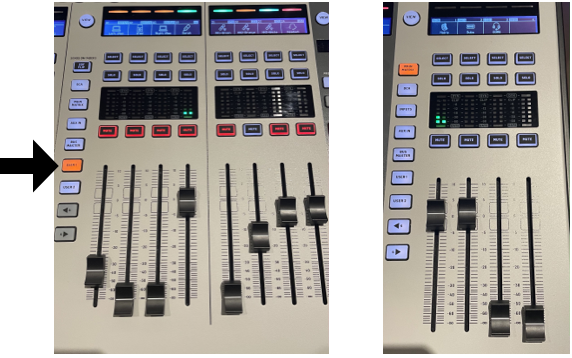

# How to Play a DVD in the Sanctuary

1. Turn things on
 - iMac
 - AVL system (sequence up)

2. Press HDMI on NovaStar (see picture)
 - In video booth press HDMI button on NovaStar (flip up cover to find HDMI button).
 - This will mirror the iMac on the LED wall.

{:height="200px" width="600px"}

3. Put DVD in
 - Put DVD into reader (on top of Mac Mini). 
 - The DVD player should open automatically.
 - If it does not use command + space to search for DVD player.

4. Full Screen
 - Click View > Enter Full Screen or push Control + Command + F on the keyboard.

5. Sound (see picture)
 - On the soundboard in the center section click User 1 button (left picture), the iMac will be the first fader.  The mains and subs should both be at 0 and are on the right side of the board (right picture). If you want less sub you can turn that fader down.

{:height="600px" width="200px"}

Troubleshooting
 - No sound - check to make sure the sound output of the iMac says Blackmagic Ultrastudio (click speaker icon on top right)
 - DVD player won’t open - make sure DVD is in and search using spotlight search for DVD player
 - Anything else - Call Zachary to walk through troubleshooting steps