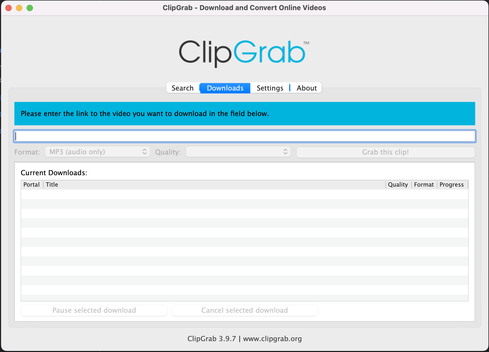

# How to Download a YouTube Video

1. Open the YouTube video in Safari
2. Copy the URL (web address)
3. Open ClipGrab
  - If not in dock then search using &#8984;+spacebar
4. Paste the URL in the search bar
  - Under the search bar make sure the format is what you want. Choose MPEG4 for a video or MP3 for audio only.
5. Click Grab this clip! (on right side)
6. Save the file

{:height="600px" width="600px"}
