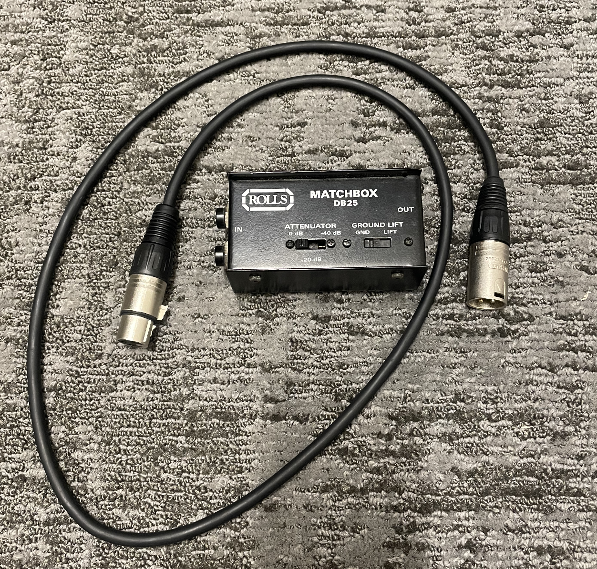
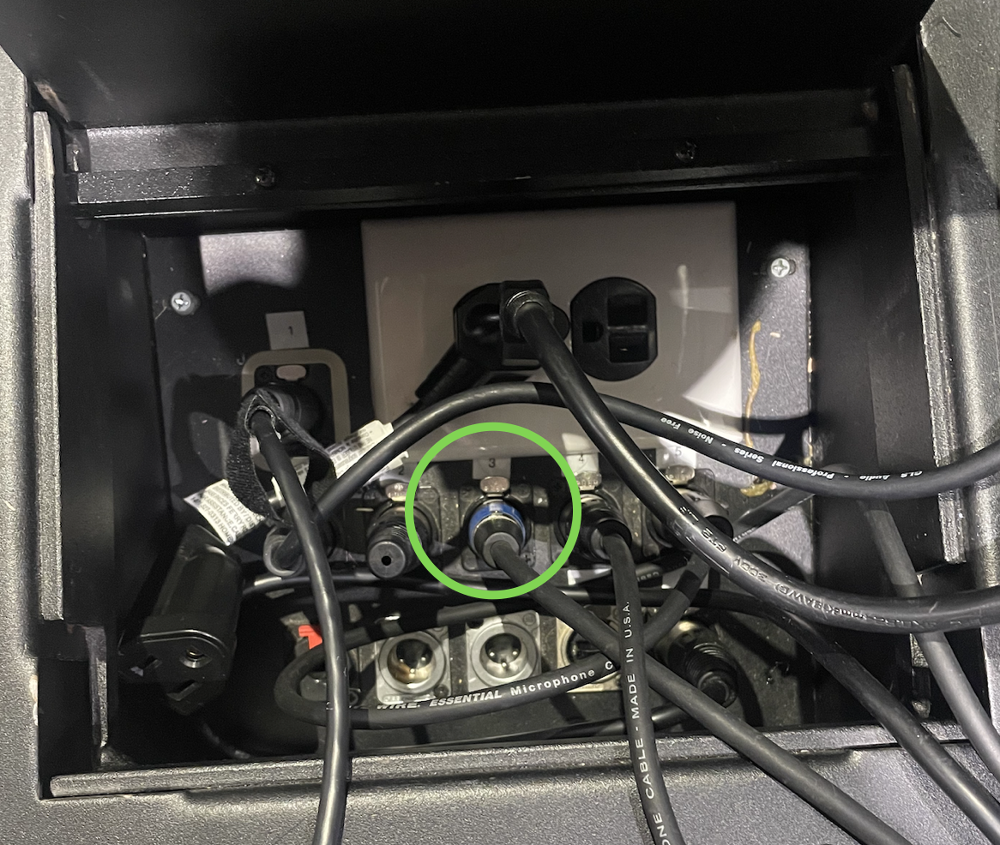

# Using the Soundbaord Default File

The default file has keys, pads, and acoustic guitar patched in. See below for plugging in a guitar for the default file.

If you need to patch in an instrument or move the input for the guitar, please see the [basic patching guide](sound-basic-patching.html).

# Using Channels

 - For vocalists, use one of the handheld microphones and a mic stand can be found in the cable close behind the stage at the top of the ramp
 - There is a channel for vocal reverb (an effect added to vocal mics) and it is setup to be on all the wireless microphone channels so you will need to turn it off when someone is talking and you do not need reverb on the channel
 - Test all inputs, channels, and reverb before the service to ensure things work as you expect them to
 
# Plugging in Guitar

1. Get an xlr wire and DI box from the cable closet behind stage at the top of the ramp (see picture of cord and DI box below)
1. Plug the xlr into input 3 (if needed unplug any wire that is plugged into input 3) and then into the DI box (see picture below)
1. Plug the guitar into the DI box

{:height="600px" width="600px"}
{:height="600px" width="600px"}
