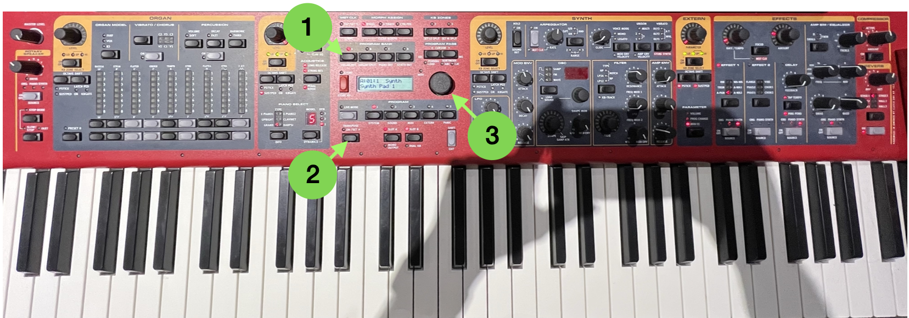
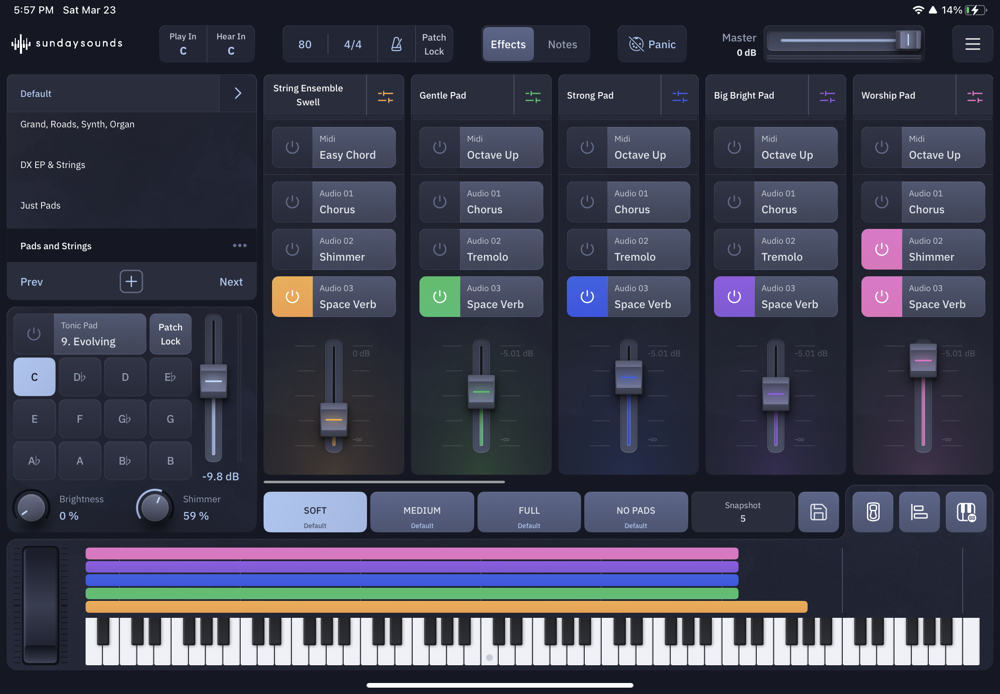

# Keys and Pads Troubleshooting

## If the keys are not working as expected:
1. Click on PROGRAM BANK A. You should see A:01:1 on the screen (see #1)

## To transpose:
1. Click button once to turn on (see #2)
1. To change the transpose value, hold button down and use knob to increase or decrease the value (see #3)

{:height="600px" width="600px"}

## No audio coming from pads:
 - Check to see if the red interface has power (power is indicated by a green light on the front of the box)
   - If no power, try flipping the power switch on the back
 - Try quitting out of the app by swiping up from the bottom towards the middle of the screen, then hold your finger down on the app and swipe it up and off the screen
 - When pressing down keys on the Nord, you should be able to see the notes on the piano on the iPad being pressed
   - If they aren’t, perhaps the USB cable is disconnected or the MIDI cable that connects the NORD to the red interface is disconnected, check these connections

{:height="600px" width="600px"}
