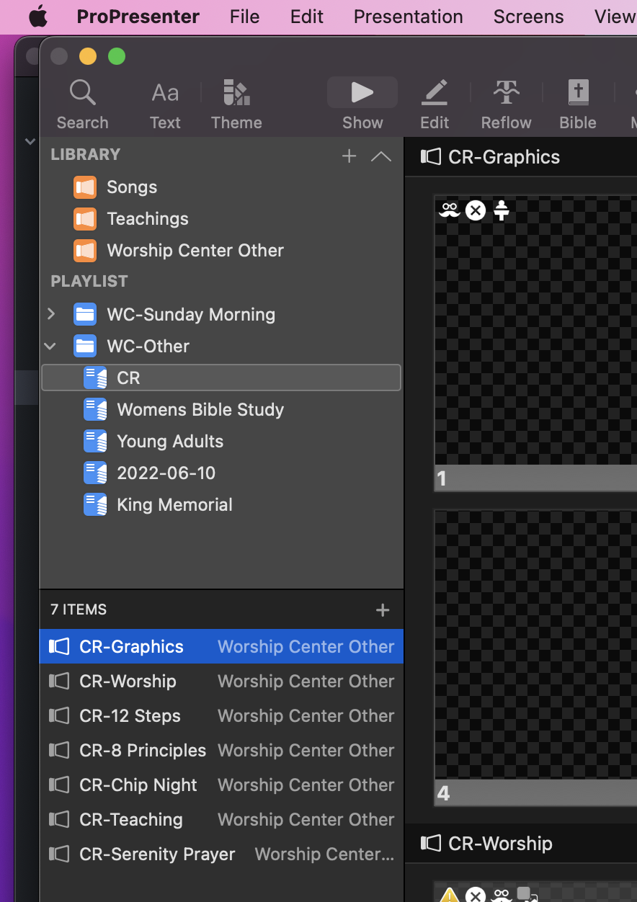
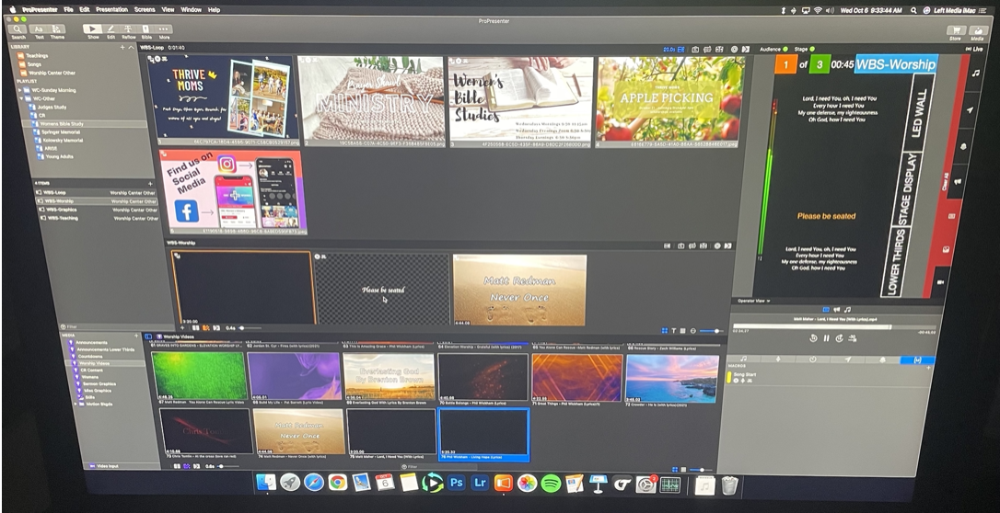
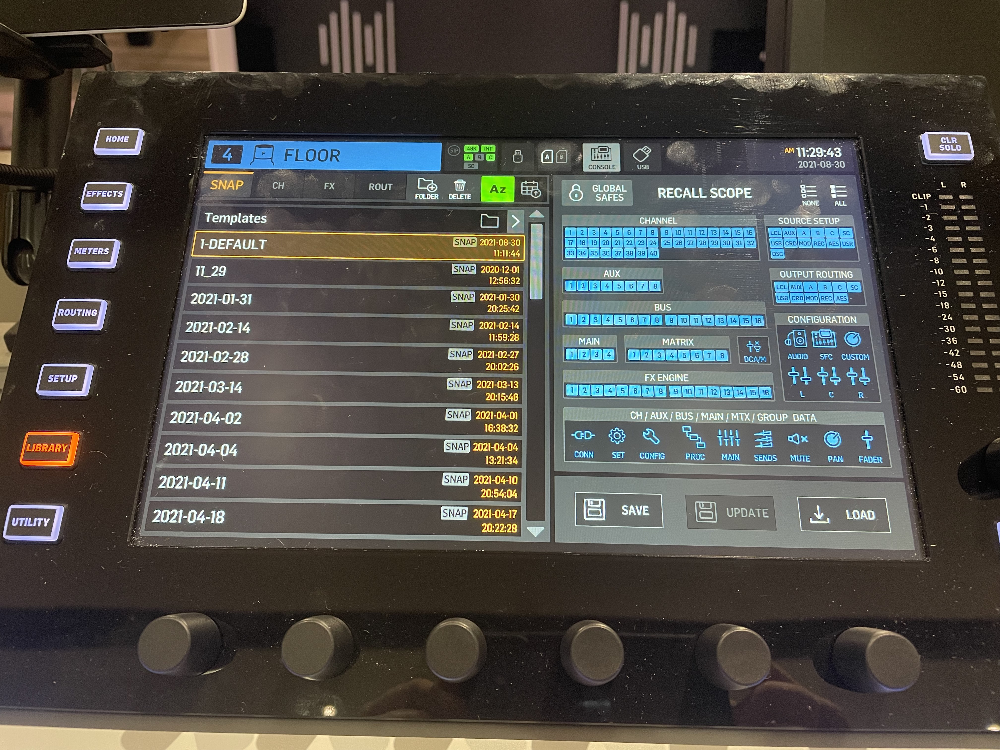
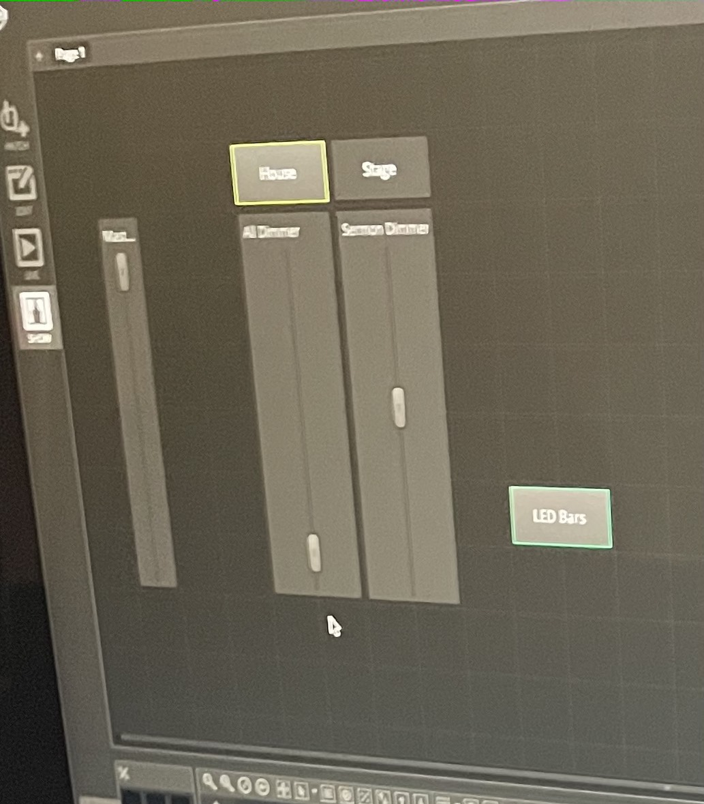
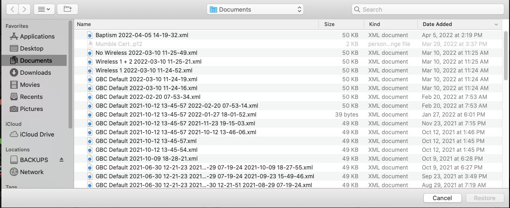
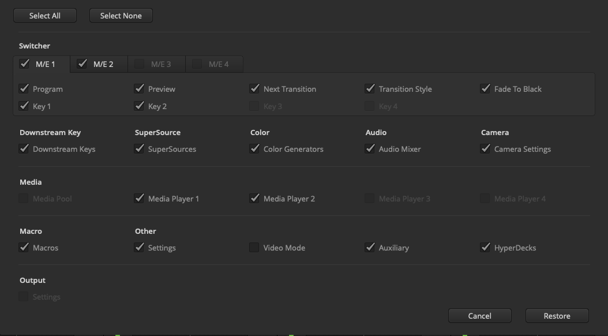
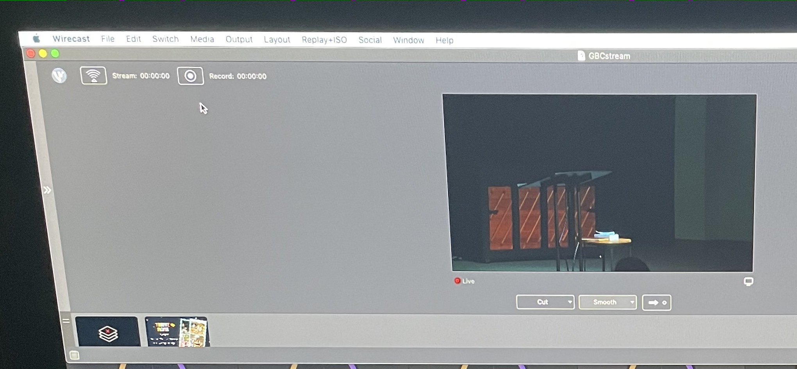

# Basic Tech Guide
{: .no_toc }
This page is meant to help as a reminder to basic startup, setup, and running of tech in the worship center and ***does not*** replace  in-person training. If you are not trained on how to use the tech in the worship center please contact Zachary to get required training.

## Table of Contents
{: .no_toc }

1. TOC
{:toc}

# Turning Things On

- Sequence Up (turn the key under the soundboard 180°)
- This is needed for running anything (sound, media, lights, video) and will turn everything on

# Media
## Opening Program

1. Open ProPresenter (orange icon on dock)
1. On left of screen find playlist you need
   - WC-Other expanded in picture to show contents

{:height="300px" width="300px"}

## Running Media
1. Click on Item below playlist to load to center section
1. Click on slide in center section to display on screen
1. On the right you will see what is being displayed on the screens
1. If you need to clear the screen or stop anything you can click clear all on the right
   - Clear all is the red vertical bar next to the output display

{:height="300px" width="300px"}

# Sound
## Load Default
See Picture Below

1. On Wing (Sound Booth) Push Library
1. On Left scroll to top if needed
1. Tap on 1-Default
1. Click Load on Right
1. Click Confirm
1. Click “User 1” and use center section for iMac, iPad, handhelds, and headset
1. Wireless microphones are located in video booth on chargers

{:height="300px" width="300px"}

## Recording or In House Streaming
See picture below for video booth soundboard setup

1. On Midas broadcast board press Scenes
1. Use Right Arrow to go to Scenes tab
1. Use Left Knob to scroll down to Mains (#01)
1. Press Left Knob to load
1. Press Right Arrow to confirm
1. Set far left and master faders to 0

{:height="300px" width="300px"}

# Lights
## Open Program & Load Show

1. On lighting computer open MyDMX (gray ADJ icon on dock)
1. Click File > Open
1. Click Desktop on left and open “Default”
1. On Left click Show
1. Click House and Stage to turn those lights on
1. Plug in house lights
   - Wire to right of light computer plug into ADJ box

## Running Lights
1. Use faders as needed during service
   - Master controls all lights
   - House for the house lights
   - Stage for lights on stage
1. There may be other buttons on this page to control various stage or effect lights
   - Test before service to determine what you will need/want

{:height="300px" width="300px"}

# Video
## Setting Up Camera System
1. Log into recording computer
1. It will start Wirecast and ATEM automatically
1. Click on ATEM (program on bottom)
1. Click File > Restore
1. Choose No Wireless
1. Click restore

{:height="300px" width="300px"}
{:height="300px" width="300px"}

1. Press 3rd button on middle row of director controller (see 3rd picture below)
   - The one below number 3
1. Click “DSK 1 CUT” if not already Red

{:height="300px" width="300px"}

## Setting Camera
1. Aim camera (next to sound booth) at podium (or wherever teaching is happening)
1. Use zoom/focus on lens if needed to get good shot

# Recording
## Starting Recording
1. Prior to the start of the service click the record button (it should turn green)
   - Do Not Click Stream
1. Make sure that the video on the computer screen is correct

{:height="300px" width="300px"}
